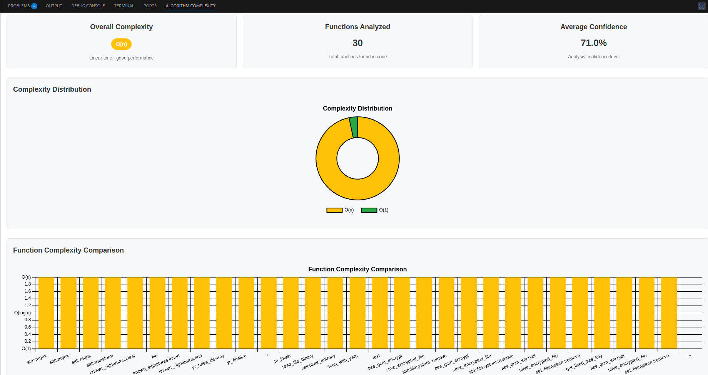

# 🚀 Algorithm Complexity Analyzer

A powerful **Visual Studio Code extension** that analyzes the algorithmic complexity (Big O notation) of your code using a **high-performance Rust WebAssembly (WASM)** engine. Get **instant insights** into your code's performance with **interactive visualizations**, **inline feedback**, and **detailed reports**.

---

## ✨ Features

### 🔍 Comprehensive Analysis
- ✅ **Multi-language support**: JavaScript, TypeScript, Python, Java, C, C++, Rust  
- ✅ **Function-level analysis**: Determine complexity for each function  
- ✅ **Overall file complexity**: Identify the worst-case complexity per file  
- ✅ **Confidence scoring**: See how reliable each analysis is  

---

### 📊 Rich Visualizations
- 📈 **Interactive doughnut charts**: Visualize complexity distribution  
- 📊 **Bar graphs**: Compare function complexities side-by-side  
- 💡 **Inline decorations**: View complexity directly in your code  
- 🧠 **Hover tooltips**: Get instant analysis explanations on hover  

---

### 🎯 Smart Detection
- 🔁 **Loop analysis**: Understand nested loops, single loops, and loop patterns  
- 🔄 **Recursion detection**: Identify tail recursion, divide-and-conquer, exponential patterns  
- 🧰 **Built-in functions**: Recognizes standard library function complexities  
- 📚 **Algorithm patterns**: Detects binary search, sorting, dynamic programming, etc.  

---

### 📈 Professional Reports
- 📋 **Detailed reports**: Full breakdown of complexity factors and patterns  
- 💾 **Export formats**: JSON, HTML, Markdown, and CSV  
- 🔐 **Confidence indicators**: Visual display of analysis confidence  
- ⚠️ **Warnings system**: Alerts for analysis limitations or ambiguities  

---

### ⚡ Performance
- ⚙️ **Rust + WebAssembly**: Ultra-fast performance and memory efficiency  
- 📦 **Memory-optimized**: Designed for large codebases  
- 🔁 **Real-time feedback**: See updates as you code  
- 🛠️ **Configurable**: Customize file size limits and analysis thresholds  

---

## 📦 Installation

Search for **`Algorithm Complexity Analyzer`** in the [VS Code Marketplace](https://marketplace.visualstudio.com/items?itemName=mkswebs.algorithm-complexity-analyzer) and click **Install**.

---

## 🛠 Usage

1. Open a file in a supported language.
2. Click the `Analyze` button or right-click and choose **Analyze Complexity**.
3. View results inline or in the sidebar panel.
4. Export the analysis from the report viewer.

---

## 🧠 Powered By

- 🦀 [Rust](https://www.rust-lang.org/)
- 🧩 [WebAssembly](https://webassembly.org/)

---
## 🎨 Complexity Color Coding

Color-coded complexity for quick visual understanding:

| Complexity   | Color      | Performance        |
|--------------|------------|--------------------|
| `O(1)`       | 🟢 Green   | Excellent          |
| `O(log n)`   | 🟢 Teal    | Very Good          |
| `O(n)`       | 🟡 Yellow  | Good               |
| `O(n log n)` | 🟠 Orange  | Acceptable         |
| `O(n²)`      | 🔴 Red     | Poor               |
| `O(n³)`      | 🟣 Purple  | Very Poor          |
| `O(n^k)`     | 🟡 Pink    | Extremely Poor     |
| `O(2ⁿ)`      | ⚫ Dark Gray | Unacceptable     |
| `O(n!)`      | ⚫ Black   | Only for Tiny Inputs |

---
## 🛠 Usage

1. **Open a file** in any supported language _(JavaScript, Python, C++, etc.)_
2. **Select code** (optional) or leave it unselected to analyze the entire file.
3. **Click the extension icon** labeled **"Complexity Analyzer"** from the activity bar or title bar.
4. The **analysis report** will be generated in the **panel below**, showing complexity metrics, graphs, and detailed explanations.

📊 **Example Report Panel:**

---
## 📣 Contribute

Pull requests and feature suggestions are welcome!  
Head to the [GitHub repo](https://github.com/mx0m/algo-complexity-analyzer) to get started.

---

## 📝 License

MIT License © 2025 
